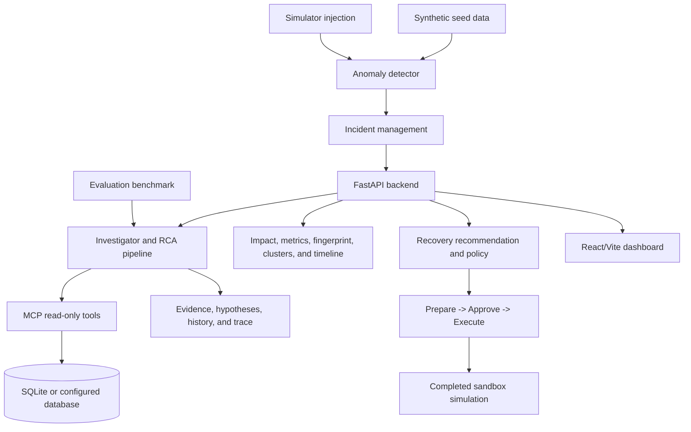

# FluxPay: AI Payment Incident Response and Revenue Recovery

FluxPay is an intelligent payment incident-response, investigation, and revenue-recovery platform. It helps an operations team move from a detected payment degradation to an evidence-backed root-cause analysis, an impact estimate, and a controlled recovery simulation.

The project uses synthetic payment data and a simulated recovery environment. It does not connect to or execute transactions against real Razorpay infrastructure.

## Project Overview

FluxPay addresses a common payment-operations problem: an incident can be detected quickly, but understanding its cause, scope, and safest response requires evidence from several systems. FluxPay assembles that evidence into a bounded investigation and keeps recovery actions behind an explicit operator approval step.

The complete lifecycle is:

```text
Seed
  -> Detect or inject incident
  -> Incident
  -> Investigation
  -> RCA
  -> Evidence / hypotheses / similar incidents
  -> Impact analysis
  -> Recovery recommendation / policy
  -> Recovery preparation
  -> Approval
  -> Human approval
  -> Bounded retry / fallback
  -> Stop or escalate
  -> Payment-level recovery ledger
  -> Audit trail and replay
```

## Architecture



The major components are:

- **FastAPI backend:** exposes dashboard, incident, investigation, simulator, metrics, payment, provider, historical-incident, and recovery APIs.
- **Database layer:** SQLAlchemy models and sessions use SQLite by default when `DATABASE_URL` is absent, or the configured database URL when supplied.
- **Synthetic data:** deterministic payment events, merchants, providers, and 30 historical incidents are created by the seed utilities.
- **Detection and incident management:** anomaly detection evaluates generated or injected payment data and persists qualifying `INC-*` incidents.
- **Investigation/RCA pipeline:** the investigator calls bounded deterministic read-only tools, compares evidence and hypotheses, retrieves similar historical incidents, and persists an `INV-*` trace and result.
- **Recovery state machine:** impact and policy services recommend a constrained strategy and persist preparation, approval, rejection, and simulated execution state.
- **React/Vite dashboard:** provides the demo workflow and displays investigation intelligence and recovery state transitions.
- **MCP server:** registers ten read-only investigation tools; the tools do not refund, retry, route, mutate configuration, or call payment providers.
- **Evaluation:** the deterministic benchmark measures classification and recovery recommendation accuracy across 20 scenarios.

## Data Model and Resource Lifecycle

FluxPay keeps incident and investigation resources separate:

| Resource | Meaning | Created by |
|---|---|---|
| `INC-*` | Persisted payment incident | `POST /api/simulator/inject/{scenario}` when detection qualifies the scenario |
| `INV-*` | Persisted investigation and RCA trace | `POST /api/investigate/{incident_id}` |
| `REC-*` | Persisted recovery execution record | `POST /api/incidents/{incident_id}/recovery` |

The investigation endpoints require an `INV-*` identifier. Therefore, `GET /api/investigations/{INC-*}` returning `404` is expected: an incident is not an investigation.

## API and Features

All endpoints use the `/api` prefix.

| Area | Endpoints |
|---|---|
| Health | `GET /api/health` |
| Dashboard | `GET /dashboard/summary` |
| Simulator | `POST /simulator/reset`, `POST /simulator/inject/{incident_type}` |
| Incidents | `GET /incidents`, `GET /incidents/{incident_id}` |
| Incident intelligence | `GET /incidents/{incident_id}/impact`, `/fingerprint`, `/clusters`, `/timeline`, `/rca-graph` |
| Investigations | `POST /investigate/{incident_id}`, `GET /investigations`, `GET /investigations/{investigation_id}` |
| Investigation detail | `GET /investigations/{investigation_id}/trace`, `/evidence`, `/hypotheses`, `/similar-incidents` |
| Recovery planning | `GET /incidents/{incident_id}/recovery-recommendation`, `GET /incidents/{incident_id}/recovery-policy` |
| Recovery lifecycle | `POST /incidents/{incident_id}/recovery`, `GET /incidents/{incident_id}/recovery`, `POST /recoveries/{recovery_id}/approve`, `/reject`, `/execute` |
| Recovery evidence | `GET /recoveries/{recovery_id}/attempts`, `GET /recoveries/{recovery_id}/events` |
| Replay | `GET /incidents/{incident_id}/replay`, `/replay/events`, `/replay/{event_id}` |
| Payments and metrics | `GET /payments`, `GET /metrics/success-rate`, `GET /metrics/failure-rate`, `GET /metrics/latency` |
| Providers and history | `GET /providers`, `GET /providers/{provider_id}/health`, `GET /historical-incidents` |
| Knowledge | `GET /knowledge/search?q=...` |

The investigation result includes the selected root cause, confidence, evidence, alternative hypotheses, rejected hypotheses, impact, historical matches, recommended next step, duration, and tool-call count. Investigation traces retain tool inputs, structured outputs, purposes, summaries, and timestamps; hidden chain-of-thought is not persisted.

## Why This Is an AI Agent

FluxPay is an evidence-driven operations agent, not an unrestricted autonomous payment bot. The investigation agent calls bounded read-only tools, gathers payment and provider evidence, compares hypotheses, retrieves historical context, and persists an RCA result. A policy layer converts that result into a recovery recommendation. A separate approval gate is required before simulated money-affecting action, and the recovery engine applies bounded attempts, fallback, stopping rules, and escalation while recording the outcome. Human operators retain control at approval and escalation boundaries.

## Recovery State Machine

Recovery is a controlled, simulated workflow. Approval does not execute the recovery.

```text
pending / not_started -> approved / not_started -> running
                                                   |
                         +-------------------------+----------------------+
                         |                         |                      |
                     completed                  blocked               escalated
                         |                         |                      |
                         +-------------------------+----------------------+
                                  terminal; no further execution
```

Rejection moves a prepared recovery to `rejected`. The service enforces these guards:

- Execution before approval is rejected.
- A rejected recovery cannot be approved.
- A completed recovery cannot be executed again.
- Retry attempts are bounded by `max_retries`; with `max_retries=2`, attempt numbers stop at 3 because the initial attempt is number 1.
- A failed primary path can execute a persisted fallback attempt; a failed fallback escalates and stops automation.
- `FAILURE_RATE_THRESHOLD` and `RECOVERY_TIME_WINDOW` are evaluated during execution and persist their stop reason and rule.
- Recovery attempts are keyed by payment and attempt number, and successful ledger rows are deduplicated for recovered economics.
- A duplicate active recovery preparation for the same incident is rejected.
- Simulation does not mutate payment rows and is marked `simulation=true`.

Rejection is represented as a cancelled/rejected approval outcome. Completed, blocked, escalated, and cancelled outcomes are terminal for automated execution.

## Measured Recovery and Auditability

`recovered_revenue` is calculated from unique successful payment-level recovery attempts using the simulator's revenue factor:

```text
recovered_revenue = sum(successful unique payment amounts) * 0.18
```

It is not copied from `estimated_recoverable_revenue`, and failed attempts contribute zero recovered amount. The values are synthetic simulation metrics; no provider or customer payment is mutated.

Recovery attempts are persisted in `recovery_attempts`. Recovery events are persisted in `recovery_events`, including `RECOVERY_PREPARED`, `RECOVERY_APPROVED`, `ATTEMPT_STARTED`, `ATTEMPT_FAILED`, `RETRY_TRIGGERED`, `FALLBACK_TRIGGERED`, `PAYMENT_RECOVERED`, `STOPPING_RULE_TRIGGERED`, `RECOVERY_ESCALATED`, `RECOVERY_EXECUTED`, and `RECOVERY_REJECTED`. The replay API consumes these persisted recovery events alongside investigation state.

`GET /api/incidents/{incident_id}/recovery` selects the latest persisted recovery deterministically by timestamp and recovery ID. The dashboard uses that ID to reload recovery metrics, attempts, and events after an incident is selected or the page is refreshed.

## Razorpay AI Revenue Recovery Mapping

| Requirement | Actual implementation |
|---|---|
| Measured money recovered across a batch | `RecoveryAttemptRecord` stores each payment-level result. Successful unique payment amounts are summed and multiplied by the simulator's 0.18 factor; estimated recoverable values are not used as recovered revenue. |
| Compliant escalation | Primary attempts can use bounded retries, then a persisted fallback attempt. A failed fallback or exhausted retry budget records the rule and reason, transitions to `escalated`, and blocks further automated execution. |
| Enforced stopping rules | `MAX_RETRIES`, `FAILURE_RATE_THRESHOLD`, `RECOVERY_TIME_WINDOW`, terminal-state checks, and duplicate-payment protection are enforced by execution logic and recorded in `recovery_events`. |
| Audit trail | Execution, payment attempts, recovery events, investigation traces, RCA results, and replay data are persisted and linked by incident/recovery identifiers. |

## Data Flow, RCA, and Replay

`Incident` identifies the detected operational event and relates to failed `Payment` rows. `Investigation` stores the agent result, evidence, hypotheses, historical matches, and trace. `RecoveryExecutionRecord` stores the lifecycle and serialized outcome. It relates to payment-level `RecoveryAttemptRecord` rows and chronological `RecoveryEventRecord` rows. The dashboard renders these persisted backend resources.

The Explainable RCA graph is generated from the persisted investigation result as Incident -> Evidence -> Hypotheses -> Root Cause -> Recovery Action. Live Incident Replay combines persisted incident and investigation state with persisted recovery events, including preparation, approval, attempts, retries, fallback, stopping, escalation, and completion where present.

## Simulator Scenarios

The simulator accepts all ten scenario names below. A `400` result means detection did not produce a qualifying incident, so no `INC-*` resource is created.

| Scenario | Verified result | Interpretation |
|---|---:|---|
| `provider_outage` | 200 | Supported |
| `payment_method_degradation` | 200 | Supported |
| `mixed_incident` | 200 | Supported |
| `regional_degradation` | 200 | Supported |
| `customer_level_failure` | 200 | Supported |
| `provider_latency_spike` | 400 | Detector/data limitation |
| `merchant_misconfiguration` | 400 | Detector/data limitation |
| `webhook_failure` | 400 | Detector/data limitation |
| `late_authorization` | 400 | Detector/data limitation |
| `normal_traffic_spike` | 400 | Expected negative control |

The four detector/data-limited scenarios are not broken API endpoints. Their scenario types are accepted, but the current detection and data conditions do not produce a qualifying detectable incident. Detection thresholds and rules were not weakened to force them to succeed. `normal_traffic_spike` is intentionally retained as a negative control.

## Frontend Demo Flow

1. Click **Reset simulator**.
2. Keep **provider_outage** selected and click **Inject incident**.
3. Select the generated `INC-*` incident.
4. Click **Investigate incident**.
5. View the RCA and confidence.
6. View evidence and reasoning trace summary.
7. View hypotheses and similar incidents.
8. View impact and revenue at risk.
9. View fingerprint, failure clusters, and timeline.
10. Review the recovery recommendation and policy.
11. Click **Prepare recovery** and confirm `pending / not_started`.
12. Click **Approve recovery** and confirm `approved / not_started`.
13. Click **Execute simulation**.
14. View measured recovered revenue, recovered transactions, retry/fallback controls, stopping state, and persisted audit events.
15. Open Live Incident Replay and inspect the lifecycle.

To demonstrate a controlled failure path, execute the recovery endpoint with a simulation policy such as `{"max_retries": 0, "fallback_strategy": "alternative_method", "recovery_window_seconds": 999999999, "primary_outcomes": ["failure"], "fallback_outcomes": ["failure"]}`. The extended window covers the synthetic incident timestamps; the persisted failed attempts, fallback event, stopping event, and escalation state show why automation stopped. This is simulation input, not a real provider call.

## Running Locally

The default local database is SQLite (`fluxpay.db`) when `DATABASE_URL` is not set. PostgreSQL can be used through the repository's Docker Compose configuration.

Initialize tables:

```bash
python -m database.init_db
```

Seed the clean demo state with 5,000 baseline payments and 30 historical incidents:

```bash
python -m data.seed --reset --events 5000 --seed 42
```

Start the API:

```bash
uvicorn apps.api.main:app --reload --host 0.0.0.0 --port 8000
```

If the `uvicorn` executable is not on PATH:

```bash
python -m uvicorn apps.api.main:app --reload --host 0.0.0.0 --port 8000
```

Start the dashboard in another terminal:

```bash
cd apps/dashboard
npm install
npm run dev
```

Open `http://localhost:5173`. The dashboard uses `VITE_API_BASE_URL` when provided and otherwise defaults to `http://localhost:8000`.

## Verification and Audit Results

These are the final verified audit results for the locked implementation:

- Pytest: **56 passed** in the latest recorded full regression run.
- Benchmark: **20/20 root-cause accuracy**.
- Benchmark: **20/20 recovery recommendation accuracy**.
- MCP: **10 read-only tools registered**.
- Frontend production build: **passed**.
- Browser smoke test: **passed** against the local stack, including incident selection rehydration, completed recovery reload, replay, and the escalated primary/fallback failure path.
- Final clean database: **5,000 payments, 30 historical incidents, 0 active incidents, 0 investigations, 0 recoveries**.

The measured benchmark can be run with:

```bash
python -m evaluation.runner
```

The runner prints a machine-readable JSON report to stdout; no generated benchmark report is committed. MCP registration can be inspected with:

```bash
python -m mcp_server
```

## Fixes Found During Audit

The following defects were identified and fixed before the final documentation pass:

| Defect | Symptom | Root cause and fix | Verification |
|---|---|---|---|
| Destructive simulator reset | Reset removed the seeded baseline payments | Reset was narrowed to operational incident-scoped payment rows and operational records | Clean reset preserved 5,000 baseline payments |
| Stale metrics | Dashboard metrics could reflect regenerated data instead of persisted records | Metrics were changed to calculate from persisted payment data | Persisted-data and dashboard checks passed |
| Incorrect synthetic duration | Incident duration depended on the real wall clock | Synthetic duration calculation was corrected to use incident timestamps | Regression tests passed |
| Repeated recovery execution | A completed recovery could be executed again | Execution now rejects any recovery not in `not_started` state | Recovery state-machine tests passed |

## Known Limitations

- `provider_latency_spike`, `merchant_misconfiguration`, `webhook_failure`, and `late_authorization` do not produce detectable incidents under the current detector/data conditions.
- `normal_traffic_spike` is an intentional negative control and does not create an incident.
- Frontend/API coverage is focused on the primary demo workflow and is not necessarily identical for every backend endpoint.
- Vite reports an existing chunk-size warning for the production bundle; the build still passes.
- No lint or typecheck script is configured in the dashboard package.
- The system is synthetic and local; it is not a deployed production payment service.
- No real customer money moves and no real payment provider is called or mutated. Recovery outcomes are simulated against persisted synthetic payment records. A production implementation would require provider adapters, provider-side idempotency, live authorization handling, and deployment controls.
- Browser and 390px viewport validation were not executablely performed in the final documentation pass.

## Design and Engineering Decisions

- Incidents and investigations use separate identifiers and resources so detection records cannot be confused with investigative traces.
- Recovery preparation, approval, and execution are separate persisted transitions to keep remediation controlled and auditable.
- Metrics read persisted payment records so dashboard values describe the same data used by incident and impact analysis.
- Injected payments use incident-scoped IDs, preserving baseline identity and preventing collisions.
- Simulator reset preserves seeded baseline payments while clearing operational state.
- Negative controls are retained instead of forcing every scenario to become an incident.
- The benchmark measures deterministic investigation and recovery behavior rather than hardcoding a score.
- MCP tools are read-only and bounded, keeping investigation separate from payment mutation.

## Submission-Ready Summary

FluxPay demonstrates an end-to-end payment incident workflow: it seeds deterministic synthetic traffic, detects or injects incidents, investigates them through read-only evidence tools, produces RCA with hypotheses and historical comparisons, quantifies impact, recommends constrained recovery, and requires explicit approval before a sandbox execution. Its FastAPI, database, detection, investigation, recovery, MCP, evaluation, and React/Vite layers are connected through persisted resource lifecycles. The final recorded audit verified 56 passing tests, 20/20 RCA accuracy, 20/20 recovery recommendation accuracy, 10 registered MCP tools, and a passing frontend build. Browser E2E and 390px viewport results are intentionally not claimed for this environment.
