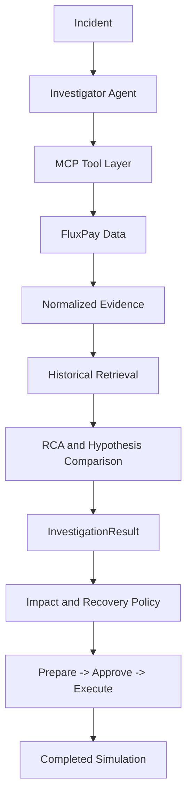

# FluxPay Investigation and Recovery Architecture

The investigation layer turns detected incidents into evidence-driven,
read-only investigations. The recovery layer consumes the resulting impact and
recommendation data through an explicit prepare, approve, and execute flow.

The agent never receives the database wholesale. It calls ten deterministic,
read-only tools in a bounded investigation and stores their inputs, outputs,
and concise evidence summaries. No tool can retry, refund, route, mutate
configuration, or call a payment provider.

## Confidence

Confidence is reproducible rather than an unconstrained model opinion:

`0.35 * min(anomaly_score / 10, 1) + 0.25 * evidence_coverage + 0.20 * agreement + 0.20 * historical_similarity - 0.20 * contradiction`

The result is clamped to `[0, 1]`. Hidden chain-of-thought is never persisted.

## Running

Set `MOCK_LLM=true` for deterministic offline investigations. Real OpenAI-
compatible providers use `LLM_BASE_URL`, `LLM_API_KEY`, and `LLM_MODEL`; keys
are server-side only. Start the API with `uvicorn apps.api.main:app --reload`.

Available endpoints include `POST /api/investigate/{incident_id}`, the
investigation list/detail/trace/evidence/hypotheses/similar-incidents routes,
incident impact/fingerprint/clusters/timeline routes, and recovery
recommendation, policy, preparation, approval, rejection, and execution routes.

`python mcp_server.py` prints the ten registered read-only tool schemas. The
tool implementations live in `apps/api/services/investigation_tools.py` and
query the existing SQLAlchemy data.

## Evaluation

`evaluation/benchmark.py` contains 20 deterministic scenario definitions. A
future benchmark runner can inject each scenario, call the mock investigator,
and calculate root-cause accuracy, evidence precision, false diagnosis rate,
average tool calls, and duration from returned structured results. Metrics are
not hardcoded. Because these 20 cases are all positive incident controls and
contain no normal-traffic negative controls, the report represents
`false_positive_rate` as `null` rather than inventing a rate.

Recovery is simulated only. Approval returns `approved/not_started`, and a
separate execution request is required to reach `completed`. Payment rows are
not mutated by the simulation.